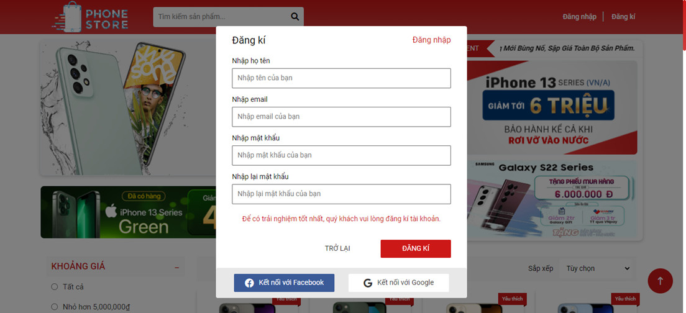
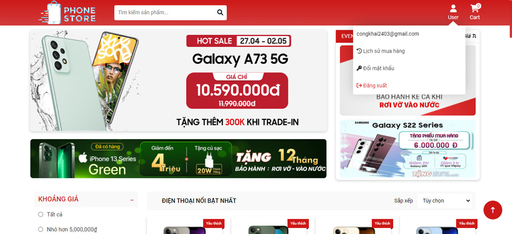
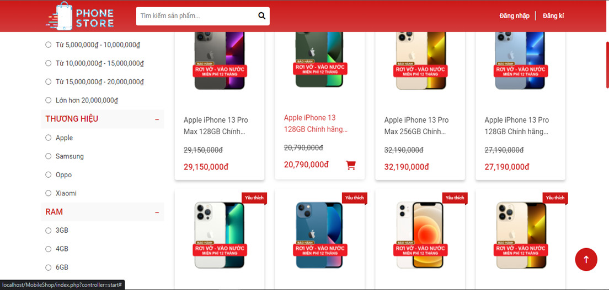
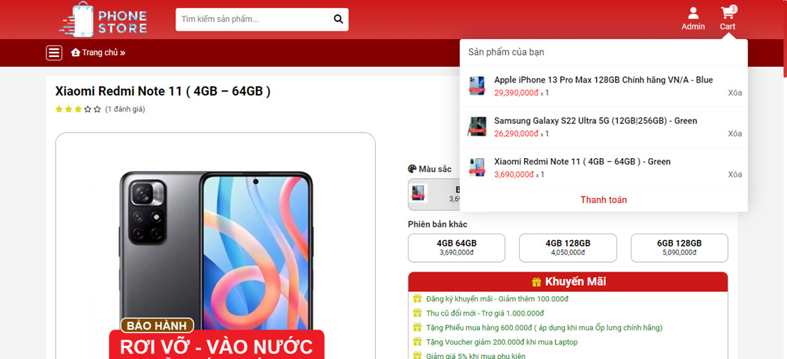
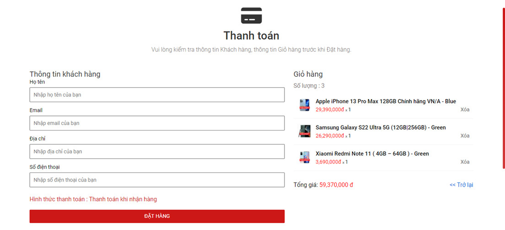
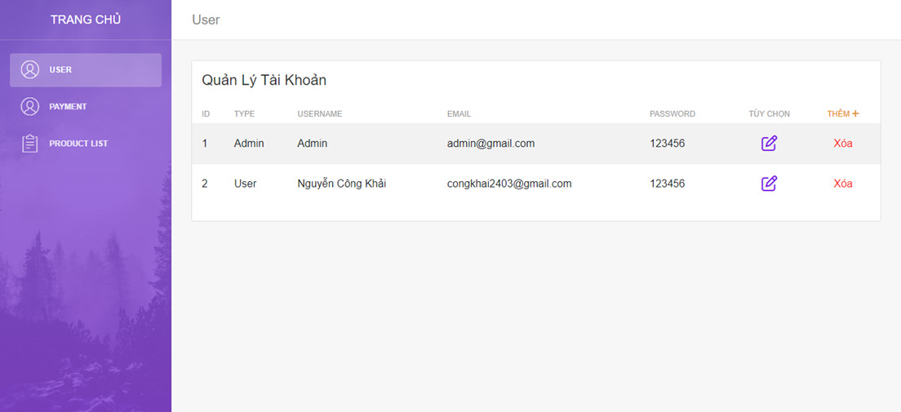
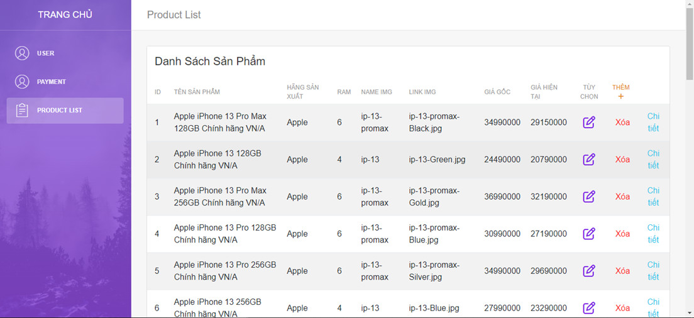

# MobileShop

## Introduce project ##

- Language: PHP, HTML, CSS, JavaScript, jQuery
- Model: Model-View-Controller (MVC)

## Instruction ##

- Install PHP + mysql
- Import file mobile.txt in folder database to create database
- Go to app/model.php to change your account to connect to database
- Done! Open website in your browser and sign up

## Demo project ##

- Login

- Home

- Product

- Payment

-Admin

